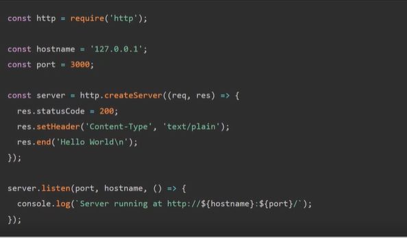
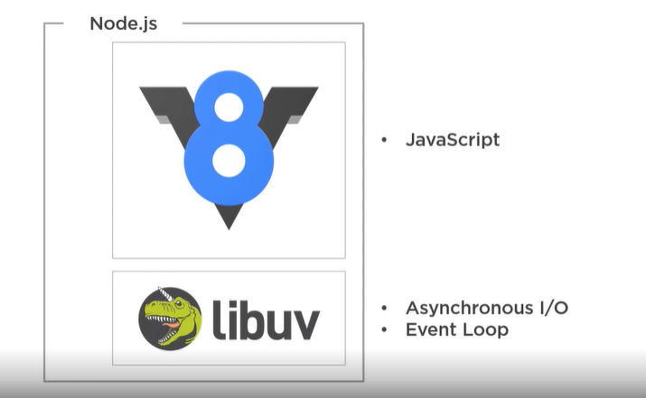
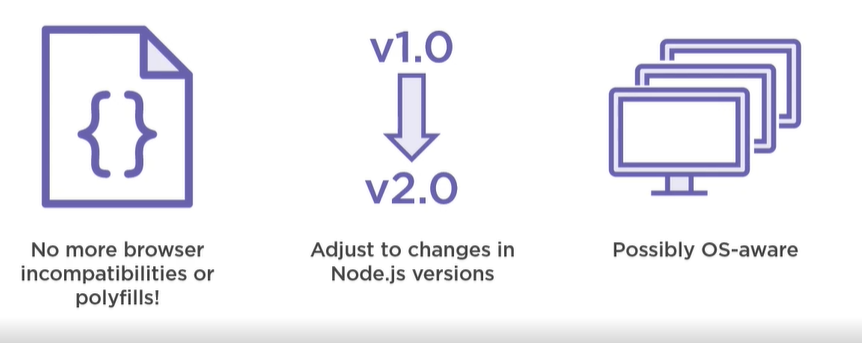
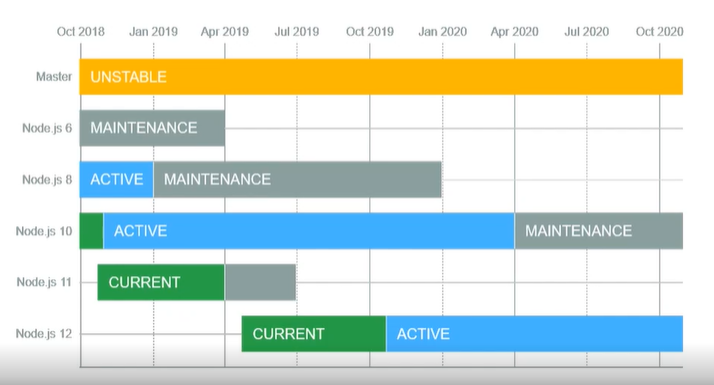
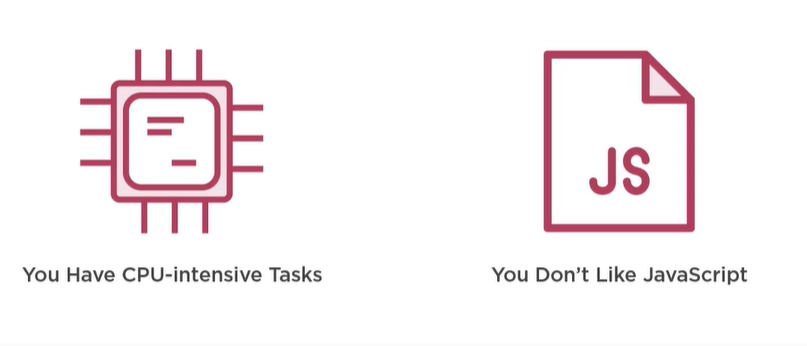
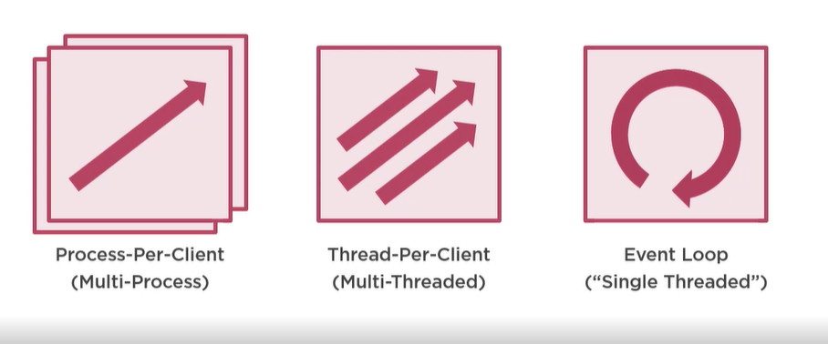

# Node JS

## What?

- Asynchronous event driven JS runtime Node is designed to build scalable network applications
- Lightweight alternative

## Where?

- Microservices and Apis
  
  

- Serverless Cloud Functions

- Command Line Applications

- Desktop Applications

## [Electron] (https://www.electronjs.org)

## Atwoods Law

- Any application that can be written in JavaScript, will eventually be written in JavaScript

## Structure 

  

## A Better Way to JS

  

## Release Candance

  

## Not a best fit

  

# How is node.js different?

  

